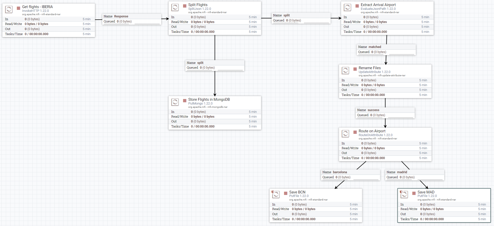

# Complex Ingestion - Real-time Flights

In this excercise we will get "real-time" (live data, but through polling) from [AviationStack](https://aviationstack.com/) and store the indidual flights.

In more detail, here is what we will do:

* Get all the flights from a specific company (IBERIA) though the REST API
* Store each individual flight in a NOSQL database (MongoDB)
* Store flights landing in Madrid and Barcelona in two different folders

With this, we will check two different ways of checking the same data (flights landing in Madrid and Barcelona).

# Pre-requisite

Setup a free account in AviationStack:

* Go to https://aviationstack.com/
* Click on "GET FREE API KEY"
* Select the "Free" plan and click on "SIGN UP"
* Fill out the form

# Details

For this exercise, given the complexity we have provided a template with all the required processors, and you will just jave to configure and connect them.

First, load and insert the template called

Now, let's start with the configuration of the processors. Here are the parameters you will need to fill:

* **InvokeHTTP**: Invoke the AviationStack REST API to get the list of live flights.
  * HTTP URL: URL which lists "Real-time Flights", using your API key and filtering by airline name ("IBERIA").
* **SplitJson**: Split the JSON returned by the API by flight (under the "data" tag). That is, extract all the flights into individual messages.
  * Json Path Expression: Select the JSON data you are interested in.
* **PutMongo**: Store each individual flight into a MongoDB collection.
  * Mongo URI: Connection string for the MongoDB instance. FYI, host is "mongo", port is "27017", user is "root" and password is "example".
  * Mongo Database Name: Database where the data will be stored (it will be autocreated).
  * Mongo Collection Name: Collection (e.g. similar to table) where the data will be stored (it will be autocreated).
* **EvaluateJsonPath**: Extract the arrival airport in order to control the process flow.
  * Destination: Select whether you want the new value to go into an attribute or the content.
  * Add a new property with a name (e.g. "arrival_airport") and in the value select the data you need from the JSON (in our case the IATA code for the arrival airport).
* **UpdateAttribute**: Rename the file that will be stored locally.
  * Add a new property to rename the file (see previous exercise as example) and rename the file with this format: "flight-<airport code>-<sequential number>.json".
* **RouteOnAttribute**: Fork the flow depending on whether it is Madrid (MAD) or Barcelona (BCN).
  * Add two new properties, one for "madrid" and one for "barcelona". In the value, use the expression language to select that the airport is MAD or BCN.
* **PutFile**: Store the file on different places depending on whether it is Madrid or Barcelona.
  * Directory: Path where you want to store it. Since we have "/tmp/data" already mapped, use a folder inside.

And, connect everything!!! Two tips here:

* Only consider the "happy path". That is, only consider successful execution and ignore failures.
* Terminate all relationships (outputs) ignored.

To finish, run the flow and confirm that the data is stored in both places:

* MongoDB: Go to MongoDB express (admin/pass) and check that the database and collection is created. We will understand this database and how to query it in the NOSQL module.
* File: You should see the files being generated in the local folder called "data".

**IMPORTANT TIP**: Take a look at the documentation of the different processors in order to understand both the configuration parameters and the relationships (outputs). For example, [SplitJson](https://nifi.apache.org/docs/nifi-docs/components/org.apache.nifi/nifi-standard-nar/1.12.1/org.apache.nifi.processors.standard.SplitJson/).

# Reference

Here is how the flow should more or less look like once finished:

# Resources

* Apache NiFi (local): https://localhost:8443/nifi
* Apache NiFi Documentation: https://nifi.apache.org/docs.html
* Apache NiFi Expresion Language Guide: https://nifi.apache.org/docs/nifi-docs/html/expression-language-guide.html 
* AviationStack API Documentation: https://aviationstack.com/documentation 
